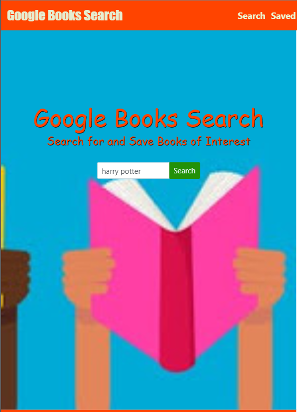
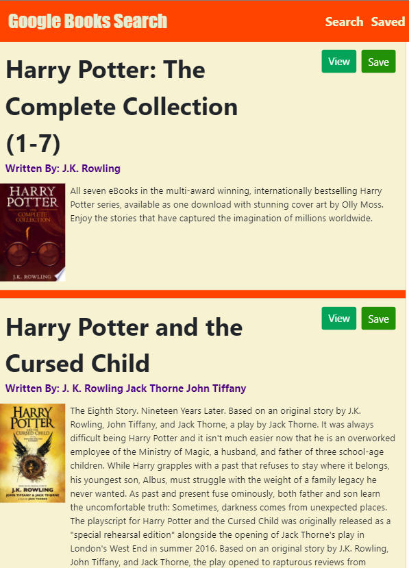
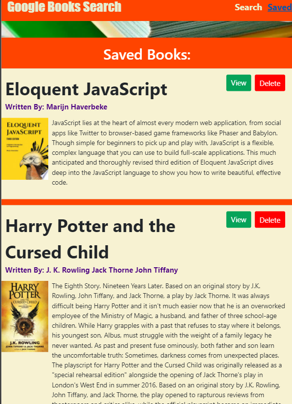

# MERN-Stack: Google Books Search


## Google Books Search

## Live URL
https://gbs-jeff.herokuapp.com/

## Description
To create a new React-based Google Books Search app. This assignment requires you to create React components, work with helper/util functions, and utilize React lifecycle methods to query and display books based on user searches. You'll also use Node, Express and MongoDB so that users can save books to review or purchase later.
## Table of Contents
* [License](#license)
* [Installation](#installation)
* [Tests](#tests)
* [Usage](#usage)
* [Packages](#packages)
* [Credits](#credits)
* [Questions](#questions)

## Installation
``` create-react-app google-books-search```
## Tests
``` Terminal Tab 1: mongod  ```
``` Terminal Tab 2: npm install, npm run seed, npm start ```
## Usage
React-based Google Books Search app that displays books on user searches. Users can save them to review.

## License
MIT

## Packages
``` mongoose, axios, react-router-dom ```

## Credits

* React.js
* MongoDB
* Express.js
* Node.js

## Questions
GitHub: https://github.com/miao0007

Email: miao188@hotmail.com

## Deployed Site Preview

### Search Page

### Search Result

### Saved Books
